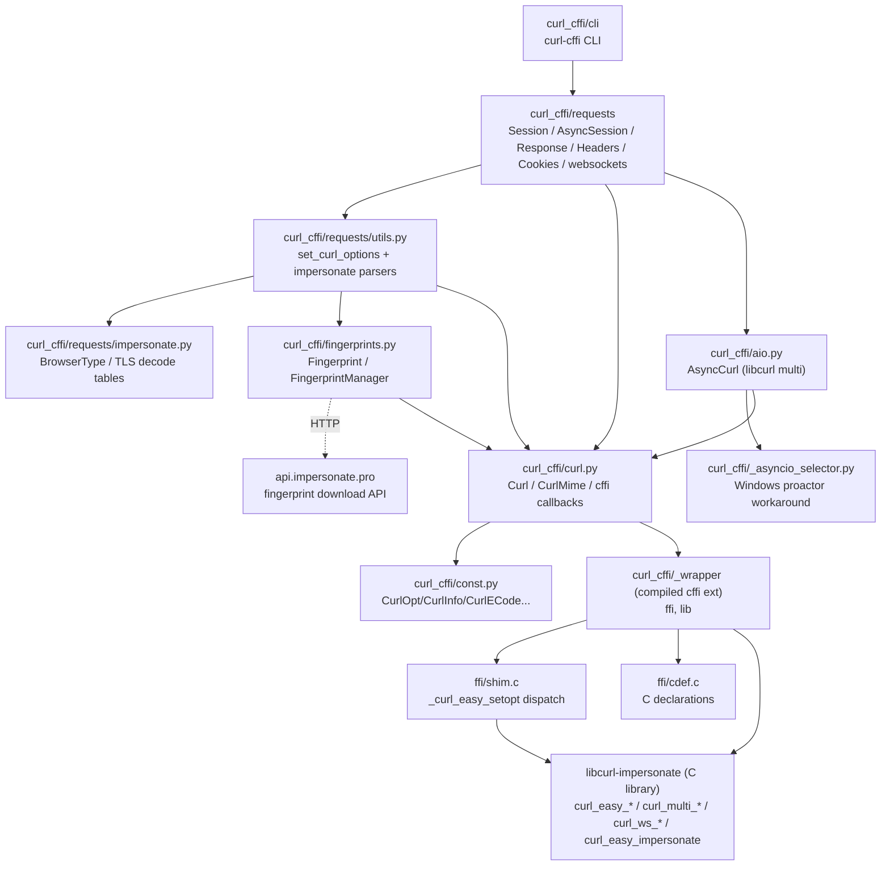
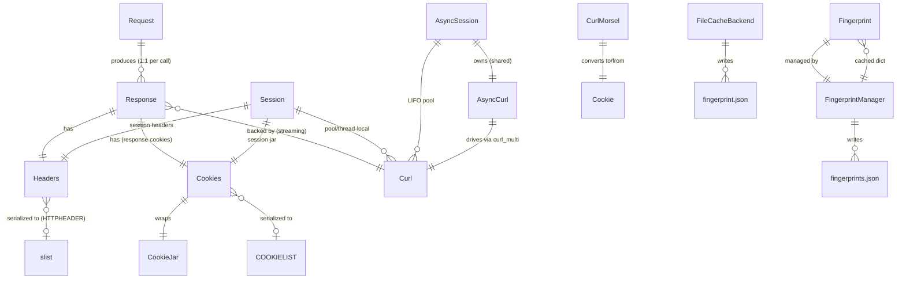

# curl_cffi — Technical Reference

> ASSUMPTION: Application name is `curl_cffi` (taken from `pyproject.toml:3` `[project].name = "curl_cffi"` and the importable package `curl_cffi/`). Slug `curl_cffi` → this file. A scan of the codebase for Claude OAuth mechanisms (Anthropic/Claude OAuth endpoints, `claude_oauth`/`anthropic_oauth` identifiers, `claude.ai`/`*.anthropic.com` OAuth issuers, `CLAUDE_OAUTH`/`ANTHROPIC_OAUTH` config keys) found none; the only OAuth-related symbol is the libcurl SMTP `XOAUTH2_BEARER` passthrough constant, documented in full in Section 7.4 and Section 9.
>
> ASSUMPTION: "Primary operations" are interpreted as the six load-bearing runtime/build operations: (1) synchronous HTTP request via `Session`, (2) asynchronous HTTP request via `AsyncSession`, (3) WebSocket connect (sync + async), (4) `curl-cffi` CLI request/replay, (5) fingerprint load/update, (6) wheel build. These are documented in Section 3.

## 0. Machine Summary

`curl_cffi` is a Python ≥3.10 library and CLI that binds the `curl-impersonate` fork of libcurl via `cffi`, exposing a `requests`-like synchronous/async HTTP API plus WebSocket support, with the distinguishing capability of impersonating browser TLS/JA3, HTTP/2, and HTTP/3 fingerprints. Version: `0.16.0b1` (`pyproject.toml:3`); upstream libcurl-impersonate pinned to `2.0.0rc3` (`scripts/build.py:17`, `Makefile:8`); upstream curl pinned to `curl-8_21_0` (`Makefile:9`).

**Tech stack:** Python 3.10–3.14 (incl. free-threaded `cp314t`), `cffi>=2.0.0`, `certifi>=2024.2.2`; optional `readability-lxml`/`markdownify`/`lxml_html_clean` (`[extra]`), `rich` (`[cli]`). Build backend: `setuptools.build_meta` + `cffi` (`pyproject.toml:65-67`). Wheel builder: `cibuildwheel` v3.3.1 producing abi3 wheels back to `cp310` (`setup.py:5`, `pyproject.toml:75`).

**Entry points:**
- Python import: `curl_cffi/__init__.py` (re-exports public surface; calls `config_warnings(on=False)` at `__init__.py:107`).
- Low-level API: `curl_cffi/curl.py:Curl`, `curl_cffi/aio.py:AsyncCurl`, `curl_cffi/curl.py:CurlMime`.
- High-level API: `curl_cffi/requests/session.py:Session` / `AsyncSession`; module-level verbs `curl_cffi.requests:{get,post,put,patch,delete,head,options,trace,query,request}` (`curl_cffi/requests/__init__.py:76`).
- WebSocket: `curl_cffi/requests/websockets.py:WebSocket` / `AsyncWebSocket`.
- CLI console script: `curl-cffi = "curl_cffi.cli:main"` (`pyproject.toml:63`); `python -m curl_cffi` → `curl_cffi/__main__.py:main`.
- Build: `setup.py:setup` registers `cffi_modules=["scripts/build.py:ffibuilder"]`; `make preprocess` / `make build` / `make gen-const` (`Makefile`).

**Top-level modules:** `curl_cffi/curl.py` (FFI binding), `curl_cffi/aio.py` (async multi driver), `curl_cffi/_asyncio_selector.py` (Windows proactor workaround, vendored from Tornado), `curl_cffi/const.py` (auto-generated libcurl enums), `curl_cffi/fingerprints.py` (Fingerprint + FingerprintManager), `curl_cffi/utils.py` (warnings), `curl_cffi/requests/` (high-level API), `curl_cffi/cli/` (CLI), `ffi/{cdef.c,shim.c,shim.h}` (C declarations + setopt shim), `scripts/build.py` (cffi builder).

**Primary data stores:** None relational. State is in-memory (`Curl` easy handles, `AsyncCurl` multi handle, `Headers`/`Cookies` containers, `Response` objects, `Fingerprint` cache) plus on-disk artifacts: `fingerprints.json` and `config.json` under the impersonate config dir (`curl_cffi/fingerprints.py:FingerprintManager`), and HAR-shaped JSON cache files under a temp dir (`curl_cffi/requests/cache.py:FileCacheBackend`).

**External dependencies:**
- `libcurl-impersonate` (lexiforest fork) — prebuilt static `.a` (macOS/Linux/Android) or dynamic `libcurl-impersonate_imp.dll` (Windows), downloaded at build time from `github.com/lexiforest/curl-impersonate/releases/download/v2.0.0rc3/` (`scripts/build.py:87`).
- Upstream `curl-8_21_0` source — patched with `curl-impersonate/patches/curl.patch` to generate patched headers (`Makefile:27`).
- `api.impersonate.pro` HTTP service — downloadable custom fingerprints (`curl_cffi/fingerprints.py:FingerprintManager.update_fingerprints`, `DEFAULT_API_ROOT = "https://api.impersonate.pro/v1"`).
- `cffi`, `certifi`, optional `orjson`/`readability`/`markdownify`/`rich`.

**OAuth:** Claude OAuth is **not** present in this codebase (a scan for Anthropic/Claude OAuth endpoints, `claude_oauth`/`anthropic_oauth` identifiers, `claude.ai`/`*.anthropic.com` OAuth issuers, and `CLAUDE_OAUTH`/`ANTHROPIC_OAUTH` config keys found none). The only OAuth-related artifact is the libcurl SMTP constant `XOAUTH2_BEARER = 10000 + 220` (`curl_cffi/const.py:209`), a passthrough `CURLOPT_XOAUTH2_BEARER` for SMTP AUTH XOAUTH2 — it is passed through `Curl.setopt` like any other `CurlOpt` (long bucket) with no token storage, PKCE, refresh, or issuer logic. It is documented in full in Section 7.4 and Section 9.

---

## 1. Architecture

`curl_cffi` is layered: a compiled cffi extension (`curl_cffi._wrapper`) wraps libcurl-impersonate; a low-level Python wrapper (`Curl`/`AsyncCurl`/`CurlMime`) exposes the `curl_easy_*` / `curl_multi_*` / `curl_mime_*` / `curl_ws_*` C APIs; a high-level `requests`-like layer (`Session`/`AsyncSession`/`Response`/`Headers`/`Cookies`) translates Python kwargs into `curl_easy_setopt` calls via `set_curl_options`; WebSocket and CLI layers sit on top.



**Textual statement of the same facts:**
- `curl_cffi/cli/__init__.py:main` builds an argparse tree and dispatches to `curl_cffi/cli/request.py:handle_request` (which calls `curl_cffi.requests:request` or `Session.request`), `curl_cffi/cli/run.py:handle_run`, `curl_cffi/cli/pro.py:handle_pro_command`, or `curl_cffi/cli/doctor.py:print_doctor`.
- `curl_cffi/requests/session.py:Session` and `AsyncSession` are the primary HTTP entry points. Both delegate per-request option construction to `curl_cffi/requests/utils.py:set_curl_options`, which mutates a `Curl` handle via `Curl.setopt` and returns a `Request` plus write/header buffers and stream-sync primitives.
- `set_curl_options` invokes the impersonation pipeline: native targets call `curl_cffi/curl.py:Curl.impersonate` → `lib.curl_easy_impersonate`; `Fingerprint` instances and named non-native targets call `curl_cffi/requests/utils.py:_apply_fingerprint` (pure-Python setopts); raw `ja3`/`akamai`/`perk`/`extra_fp` are parsed by `set_ja3_options`/`set_akamai_options`/`set_perk_options`/`set_extra_fp`.
- `curl_cffi/fingerprints.py:FingerprintManager` loads named fingerprints (native stubs merged with `fingerprints.json`) and downloads custom fingerprints from `api.impersonate.pro` using a raw `Curl` (no impersonation, to avoid bootstrap recursion).
- `AsyncSession` owns one `curl_cffi/aio.py:AsyncCurl` (lazily, shared across concurrent requests) and a LIFO pool of `Curl` handles. `AsyncCurl` drives one `curl_multi` handle from the asyncio loop via the `curl_multi_socket_action` API plus two `extern "Python"` callbacks (`timer_function`, `socket_function`).
- On Windows, when the loop is a `ProactorEventLoop` (which lacks `add_reader`), `curl_cffi/aio.py:get_selector` wraps it in `curl_cffi/_asyncio_selector.py:AddThreadSelectorEventLoop` (vendored from Tornado v6.4.0), which runs `select.select` in a daemon thread.
- The compiled extension `curl_cffi._wrapper` is produced by `scripts/build.py:ffibuilder`; its C interface is declared in `ffi/cdef.c` and its C source is `ffi/shim.c` (the `_curl_easy_setopt` type-dispatch shim). All libcurl calls go through `lib` (the cffi binding) exposed by `_wrapper`.
- `curl_cffi/const.py` is auto-generated by `scripts/generate_consts.py` from the patched `curl.h`; it exposes `CurlOpt`, `CurlInfo`, `CurlMOpt`, `CurlECode` plus hand-maintained `CurlHttpVersion`/`CurlWsFlag`/`CurlSslVersion`/`CurlIpResolve`/`CurlFollow`.

---

## 2. Module & Directory Map

| Path | Responsibility |
|---|---|
| `curl_cffi/__init__.py` | Package root; `__all__`; imports `ffi, lib` from `_wrapper`; re-exports public surface; calls `config_warnings(on=False)` at import. |
| `curl_cffi/__main__.py` | `python -m curl_cffi` entry; calls `curl_cffi.cli:main`. |
| `curl_cffi/__version__.py` | `__version__`, `__title__`, `__description__`, `__curl_version__` (lazily resolved via `_resolve_curl_version` → `lib.curl_version()` without creating an easy handle). |
| `curl_cffi/curl.py` | `Curl` (curl_easy_* lifecycle, `setopt`/`getinfo` dispatch, ws I/O), `CurlMime`, `CurlError`, five `@ffi.def_extern()` callbacks (`buffer_callback`, `write_callback`, `read_buffer_callback`, `read_callback`, `debug_function`), `slist_to_list`, `_default_cacert`/`DEFAULT_CACERT`. |
| `curl_cffi/aio.py` | `AsyncCurl` (curl_multi driver), `timer_function`/`socket_function` extern callbacks, `get_selector` (Windows proactor workaround), `_force_timeout` 100ms backstop. |
| `curl_cffi/_asyncio_selector.py` | Vendored Tornado v6.4.0 `SelectorThread` + `AddThreadSelectorEventLoop`; provides `add_reader` family on Windows ProactorEventLoop via a daemon `select.select` thread. |
| `curl_cffi/const.py` | Auto-generated `IntEnum` constants: `CurlOpt`, `CurlInfo`, `CurlMOpt`, `CurlECode`; hand-maintained `CurlHttpVersion`, `CurlWsFlag`, `CurlSslVersion`, `CurlIpResolve`, `CurlFollow`. Drives `setopt`/`getinfo` type bucketing. |
| `curl_cffi/fingerprints.py` | `Fingerprint` dataclass, `NATIVE_IMPERSONATE_TARGETS` (38 compiled-in targets), `FingerprintManager` (config-dir/API resolution, cached `load_fingerprints`, `update_fingerprints`, `get_fingerprint`, `list_fingerprints`), `get_fingerprint`, `FingerprintUpdateError`, `DEFAULT_API_ROOT`. |
| `curl_cffi/utils.py` | `CurlCffiWarning`, `config_warnings(on=False)`, `HttpVersionLiteral`. |
| `curl_cffi/requests/__init__.py` | High-level public API: `Session`, `AsyncSession`, verbs (`get`/`post`/...), `Request`, `Response`, `Headers`, `Cookies`, `WebSocket`/`AsyncWebSocket`, `ExtraFingerprints`, `CacheBackend`/`FileCacheBackend`, type aliases. |
| `curl_cffi/requests/session.py` | `BaseSession`, `Session` (thread-pool/`eventlet`/`gevent` perform), `AsyncSession` (AsyncCurl + LIFO pool), `RetryStrategy`, `ProxySpec`, `RequestParams`/`StreamRequestParams`/`BaseSessionParams` TypedDicts. |
| `curl_cffi/requests/models.py` | `Request` (thin holder), `Response` (all response state + `.text`/`.json`/`.content`/streaming `iter_content`/`aiter_content`/`iter_lines`/`aiter_lines`/`acontent`/`atext`), `STREAM_END`, `REDIRECT_STATI`, `clear_queue`. |
| `curl_cffi/requests/headers.py` | `Headers` (case-insensitive multi-value `MutableMapping`, backed by `(raw_key, lower_key, value)` byte triples), `HeaderTypes`, `normalize_header_key`/`normalize_header_value`, `obfuscate_sensitive_headers`. Adapted from httpx. |
| `curl_cffi/requests/cookies.py` | `Cookies` (CookieJar-backed `MutableMapping`), `CurlMorsel` (Netscape/curl cookie interop), `CookieTypes`. Handles `__Secure-`/`__Host-` prefix enforcement, `CookieConflict`, curl SET/DELETE change application. Adapted from httpx. |
| `curl_cffi/requests/utils.py` | `set_curl_options` (single sink for all per-request setopts), `_apply_fingerprint`, `set_ja3_options`/`set_akamai_options`/`set_perk_options`/`set_extra_fp`, `toggle_extensions_by_ids`, URL/proxy/SSL/timeout/redirect helpers, `NotSetType`/`NOT_SET` sentinel. 1027 lines. |
| `curl_cffi/requests/impersonate.py` | `BrowserTypeLiteral`, legacy `BrowserType` enum, `REAL_TARGET_MAP`, `resolve_latest_browser_type`, `DEFAULT_*` constants, `ExtraFingerprints`/`ExtraFpDict`, TLS decode tables (`TLS_VERSION_MAP`, `TLS_CIPHER_NAME_MAP`, `TLS_EXTENSION_NAME_MAP`, `TLS_EC_CURVES_MAP`), `toggle_extension`. |
| `curl_cffi/requests/websockets.py` | `WebSocket` (sync), `AsyncWebSocket` (async, background `_read_loop`/`_write_loop`), `BaseWebSocket`, `AsyncWebSocketContext`, `WsCloseCode`, `WebSocketError`/`WebSocketClosed`/`WebSocketTimeout`, `WebSocketRetryStrategy`. 1934 lines. |
| `curl_cffi/requests/cache.py` | `CacheBackend` (ABC, HAR-shaped), `FileCacheBackend` (atomic JSON files), `normalize_cache_backend`, `CacheSpec`. |
| `curl_cffi/requests/exceptions.py` | `RequestException` hierarchy, `CODE2ERROR` map, `code2error` (RECV_ERROR+CONNECT→ProxyError). |
| `curl_cffi/requests/errors.py` | 0.5.x-compat shim: `RequestsError = RequestException`. |
| `curl_cffi/cli/__init__.py` | `main`, `build_parser`, `_add_common_flags`, `_add_request_positionals`, `_print_help`. |
| `curl_cffi/cli/parse.py` | `SUPPORTED_METHODS`, `process_url`, `ParsedItems`, `parse_request_items`. |
| `curl_cffi/cli/request.py` | `handle_request`, `_execute_request`. |
| `curl_cffi/cli/output.py` | `print_output`, `determine_print_spec`, `_print_*` helpers, `handle_download`, `HAS_RICH`. |
| `curl_cffi/cli/run.py` | `parse_http_file`, `_parse_http_block`, `_run_http_file`, `_run_har_file`, `handle_run`, `HttpFileRequest`, `_SKIP_HAR_HEADERS`. |
| `curl_cffi/cli/pro.py` | `add_pro_parsers`, `handle_pro_command`, `_validate_api_key`, table/json renderers. |
| `curl_cffi/cli/doctor.py` | `print_doctor` (environment diagnostics). |
| `ffi/cdef.c` | cffi cdef: easy/multi/mime/ws/slist prototypes, `curl_slist`/`CURLMsg`/`curl_ws_frame` structs, 7 `extern "Python"` callback signatures. |
| `ffi/shim.c` | `_curl_easy_setopt`: dispatch by `CURLOPTTYPE_*` range (long / curl_off_t / raw pointer). |
| `ffi/shim.h` | Declares `_curl_easy_setopt`; `#define CURL_STATICLIB`; includes `curl/curl.h`. |
| `scripts/build.py` | `ffibuilder` (FFI), `detect_arch`, `download_libcurl`, `get_curl_archives`, `get_curl_libraries`, `is_android_env`. |
| `scripts/generate_consts.py` | Regenerates `const.py` via `gcc -E` on `curl.h`. |
| `scripts/check_preset.py` | AST consistency checker: `BrowserTypeLiteral` == `BrowserType` == `NATIVE_IMPERSONATE_TARGETS`; `DEFAULT_*` == `REAL_TARGET_MAP[alias]`. |
| `scripts/homebrew.py` | Updates Homebrew formula `url`/`sha256` from PyPI JSON. |
| `scripts/bump_version.sh` | `gsed` version bumper (Python pkg + upstream). |
| `scripts/download_curl.sh` | Standalone curl download+patch subset. |
| `libs.json` | 14-entry platform/arch/libc/link_type/obj_name matrix consumed by `detect_arch`. |
| `Makefile` | `preprocess`/`.preprocessed`, `gen-const`, `build`, `test`, `lint`, `format`, `clean`. |
| `setup.py` | `cffi_modules=["scripts/build.py:ffibuilder"]`, `bdist_wheel_abi3` cmdclass. |
| `pyproject.toml` | Metadata, deps, optional-dependencies, `[build-system]`, `[tool.setuptools]`, `[tool.cibuildwheel.*]`, ruff/mypy/isort/pytest config. |
| `.github/workflows/build-and-test.yaml` | lint + sdist + bdist (5-runner matrix) + bdist_android + build_latest. |
| `.github/workflows/release.yaml` | v* tag → build-and-test → PyPI OIDC publish + GitHub Release. |
| `.github/workflows/test-pro.yaml` | Pro-fingerprint tests with `IMPERSONATE_API_KEY` secret. |
| `.github/workflows/pr-checklist.yaml` | PR-body checkbox gate. |
| `.readthedocs.yaml` + `docs/conf.py` | Sphinx docs build on RTD. |
| `skills/imp-fetch/SKILL.md` | User-facing skill doc for the `curl-cffi` CLI. |

---

## 3. Data & Control Flow

### 3.1 Synchronous HTTP request (`Session.request` → `Curl.perform`)

```mermaid
sequenceDiagram
  participant U as User
  participant S as Session
  participant SO as set_curl_options
  participant C as Curl
  participant L as libcurl (_wrapper)
  U->>S: s.request(method, url, **kwargs)
  S->>S: _check_session_closed; retry loop
  S->>SO: set_curl_options(curl, method, url, lists...)
  SO->>SO: URL requote, body/json, headers, cookies, proxy, verify, impersonate
  SO->>C: curl.setopt(CurlOpt.*, ...) [many]
  SO->>C: c.impersonate(target) OR _apply_fingerprint(fp)
  SO-->>S: (req, buffer, header_buffer, q, header_recved, quit_now)
  S->>C: c.perform()
  C->>C: _ensure_cacert (CAINFO/PROXY_CAINFO)
  C->>L: curl_easy_perform
  L-->>C: callbacks fire (buffer_callback/write_callback/header)
  C->>C: clean_handles_and_buffers (finally)
  S->>S: _parse_response(curl, buffer, header_buffer, ...)
  S->>S: cache.set(req, rsp) if enabled
  S-->>U: Response
```

**Step-by-step (file:symbol at each hop):**
1. `curl_cffi/requests/session.py:Session.request` (line 804) calls `_check_session_closed`; enters retry loop `for attempt in range(strategy.count + 1)`.
2. `Session._request_once` (line 618): if `stream`, `c = self.curl.duphandle()` + `self.curl.reset()`; else `c = self.curl` (thread-local via `curl` property, line 518).
3. `_request_once` calls `curl_cffi/requests/utils.py:set_curl_options` (line 667) with merged session+per-call lists (`headers_list=[self.headers, headers]`, `cookies_list=[self._cookies, cookies]`, `proxies_list=[self.proxies, proxies]`, `verify_list=[self.verify, verify]`, `params_list=[self.params, params]`).
4. `set_curl_options` (line ~606) normalizes method (POST→`CurlOpt.POST=1`, non-GET→`CUSTOMREQUEST`, HEAD→`NOBODY=1`); merges/requotes URL (`update_url_params`, `quote_path_and_params`, `requote_uri`); sets `CurlOpt.URL`.
5. Body: dict/list/tuple→urlencode, str→encode, `BytesIO`→read, bytes passthrough, `json`→`json.dumps(separators compact)`. `POSTFIELDS`+`POSTFIELDSIZE` set when body truthy or method in (POST,PUT,PATCH); GET-with-body also sets `CUSTOMREQUEST=GET`.
6. Headers: `Headers(base_headers, encoding)` then `h.update(headers)`; build `header_lines` (`None`→`k:` disable, `''`→`k;` empty, else `k: v`); inject Content-Type for json/form; forcibly set `Expect:` empty; `CurlOpt.HTTPHEADER` = encoded lines. Construct `curl_cffi/requests/models.py:Request(url, h, method, request_body)`.
7. Cookies: `CurlOpt.COOKIEFILE=b''` (enable engine), `COOKIELIST='ALL'` (clear); for base+temp cookies, `curl_cffi/requests/cookies.py:Cookies.get_cookies_for_curl(req)` → `CurlMorsel.to_curl_format()` → `CurlOpt.COOKIELIST`.
8. `auth`→`USERNAME`/`PASSWORD`. Timeout dispatch (None→0; tuple (connect,read)→`CONNECTTIMEOUT_MS` + `TIMEOUT_MS`/`LOW_SPEED`; scalar→`TIMEOUT_MS`). Redirects (`FOLLOWLOCATION`, `MAXREDIRS`; `'safe'`→`CurlFollow.SAFE`). Proxy resolution by scheme then `all` then host-scoped. Verify (`SSL_VERIFYPEER`/`HOST`; `c._skip_cacert`). `referer`/`accept_encoding`/`cert`/`interface`/`doh_url`/`max_recv_speed`.
9. `http_version` set via `normalize_http_version` → `CurlOpt.HTTP_VERSION` **before** impersonation.
10. Impersonate dispatch (line ~909): `Fingerprint` instance → `_apply_fingerprint`; `_is_native_impersonate_target` → `resolve_latest_browser_type` then `curl_cffi/curl.py:Curl.impersonate` (non-zero ret → `ImpersonateError`); else `_load_named_fingerprint` → `_apply_fingerprint`. Then `ja3`/`extra_fp`/`akamai`/`perk` (each warns if `impersonate` also set) applied in that order; later overrides earlier.
11. Output sink: `stream`→`queue_class()`+`event_class()` + a writefunc that sets `header_recved`, returns `CURL_WRITEFUNC_ERROR` if `quit_now` set, else `q.put_nowait(chunk)`; `content_callback`→`WRITEFUNCTION`; else `BytesIO`→`WRITEDATA`. `header_buffer=BytesIO()`→`HEADERDATA` always.
12. `curl_options` dict applied LAST (may override anything). Returns `(req, buffer, header_buffer, q, header_recved, quit_now)`.
13. Back in `_request_once`: cache check `_cache_enabled` → `self.cache.get(req)`; on hit, update cookies, `raise_for_status` if set, `c.reset()`, return cached `Response`.
14. Non-stream: `c.perform()` (line 781) — or `eventlet.tpool.execute(c.perform)` / `gevent.get_hub().threadpool.spawn(c.perform).get()` if `thread` engine set. On `CurlError`, `_parse_response` builds a partial `Response`, `code2error(e.code, str(e))` raises the mapped exception `from e`.
15. `curl_cffi/curl.py:Curl.perform` (line 495): `_ensure_cacert()` (sets `CAINFO`+`PROXY_CAINFO` unless `_skip_cacert`/`_is_cert_set`); `lib.curl_easy_perform(self._curl)`; `_check_error`; `clean_handles_and_buffers` in `finally`.
16. During perform, libcurl invokes extern-Python callbacks: `buffer_callback` writes body bytes to `BytesIO`; `header_callback` accumulates headers; `debug_function` if debug. `curl_cffi/requests/utils.py:peek_queue`/`session.py:_peek_queue` for stream error inspection.
17. `BaseSession._parse_response` (line 311) reads `getinfo` (`EFFECTIVE_URL`, `HTTP_VERSION`, `RESPONSE_CODE`, `PRIMARY_IP`/`PORT`, `LOCAL_IP`/`PORT`, `TOTAL_TIME`, `REDIRECT_COUNT`/`URL`, `SIZE_DOWNLOAD_T`/`SIZE_UPLOAD_T`/`HEADER_SIZE`/`REQUEST_SIZE`, `COOKIECHANGES`), parses header lines (folding continuation lines, splitting on blank line for redirects, `get_reason_phrase`), builds `rsp.headers=Headers(header_list)`, `rsp.cookies` from `Set-Cookie`, merges session cookies from `COOKIECHANGES` (unless `discard_cookies`). Sets `rsp.ok = 200 <= status_code < 400`.
18. `cache.set(req, rsp)` if enabled (`should_store_response` = `rsp.ok`). `c.reset()` in `finally`. Return `rsp`.

### 3.2 Asynchronous HTTP request (`AsyncSession.request` → `AsyncCurl`)

1. `curl_cffi/requests/session.py:AsyncSession.request` (line 1463): `_check_session_closed`; retry loop.
2. `AsyncSession._request_once` (line 1304): `curl = await self.pop_curl()` — awaits a slot from `asyncio.LifoQueue(self.max_clients)`; if slot is `None`, constructs `Curl(cacert=self.acurl._cacert, debug=self.debug)`.
3. `set_curl_options(...)` as in 3.1 (with `queue_class=asyncio.Queue`, `event_class=asyncio.Event`).
4. Non-stream: `task = self.acurl.add_handle(curl)` (line 1443); `await task`.
5. `curl_cffi/aio.py:AsyncCurl.add_handle` (line 237): `curl._ensure_cacert()`; `lib.curl_multi_add_handle`; create `asyncio.Future`; register `_curl2future[curl]=future`, `_curl2curl[curl._curl]=curl`; return future.
6. libcurl synchronously invokes `timer_function` (aio.py:118) → cancels prior `_timer` → `loop.call_later(timeout_ms/1000, process_data, CURL_SOCKET_TIMEOUT, CURL_POLL_NONE)`.
7. When `call_later`/reader/writer fires, `AsyncCurl.process_data` (line 259): early-return if `_curlm is None`; `socket_action(sockfd, ev_bitmask)` → `lib.curl_multi_socket_action`. During this, libcurl calls `socket_function` (aio.py:142) which `remove_reader`/`remove_writer` then `add_reader`/`add_writer` for `process_data` based on `CURL_POLL_IN`/`OUT`/`REMOVE`.
8. `process_data` drains `curl_multi_info_read`; on `CURLMSG_DONE`, `curl = _curl2curl[easy_handle]`; `retcode==0`→`set_result(curl)` else `set_exception(curl, curl._get_error(retcode, 'perform'))`. `_pop_future` (line 295) calls `curl_multi_remove_handle` and pops both maps; resolves/cancels the future.
9. `_force_timeout` (line 228): background task loops `socket_action(CURL_SOCKET_TIMEOUT, CURL_POLL_NONE)` every 0.1s as a backstop for missed libcurl signals.
10. The awaiting coroutine wakes; `_parse_response`; `release_curl(curl)` in `finally` (line 1460): `clean_handles_and_buffers`; `acurl.remove_handle` (defensive); `curl.reset()`; `push_curl` back to pool (or `curl.close()` if session closed).
11. Streaming variant (line 1389): `task = acurl.add_handle(curl)`; an inner `perform()` coroutine awaits `task`, feeds the queue, sets `header_recved`, puts `STREAM_END`; `cleanup` callback calls `release_curl`. `await header_recved.wait()`; `_parse_response`; `rsp.astream_task = stream_task`.

### 3.3 WebSocket connect

**Sync** (`curl_cffi/requests/websockets.py:WebSocket.connect`): `set_curl_options(method='GET')` → `curl.setopt(CurlOpt.CONNECT_ONLY, 2)` (magic WebSocket mode, `websockets.py:407`) → `curl.perform()` (HTTP Upgrade). Then `recv`/`send` use `curl_cffi/curl.py:Curl.ws_recv`/`ws_send` (`lib.curl_ws_recv`/`lib.curl_ws_send`); `recv` loops `recv_fragment` reassembling until `frame.bytesleft==0 AND flags&CONT==0`; `CurlECode.AGAIN` → `select.select([sock_fd],[],[],0.5)`. `run_forever` drives a callback loop (`on_open`/`on_data`/`on_message`/`on_close`/`on_error`). `close` packs a CLOSE frame (`struct.pack("!H", code)+message`) and `terminate()`s.

**Async** (`curl_cffi/requests/session.py:AsyncSession.ws_connect`): returns `AsyncWebSocketContext` wrapping `_connect_coro`. The coroutine: `pop_curl`; `set_curl_options(method='GET')`; `TCP_NODELAY=1`; `CONNECT_ONLY=2`; `await loop.run_in_executor(None, curl.perform)` (WS upgrade; on failure `curl.close()` + `push_curl(None)`); construct `AsyncWebSocket(session, curl, **config)`; `ws._start_io_tasks()` — captures `_sock_fd` from `ACTIVESOCKET`, creates `_read_task`/`_write_task`. Background `_read_loop` drains `curl_ws_recv` into `_receive_queue` (EAGAIN→`add_reader`+await; `GOT_NOTHING`→finalize `WebSocketClosed(ABNORMAL_CLOSURE)`; retry on configured `CurlECode`s with exponential backoff). `_write_loop` drains `_send_queue` via `_send_payload` (fragments into 65536-byte chunks using `CURLWS_CONT`). `send`/`recv` are non-blocking queue ops. `close` does graceful handshake (enqueue CLOSE + `flush` + `terminate`); `terminate` is thread-safe/idempotent and pushes `None` to the session pool (WS curls are **not** reusable).

### 3.4 CLI request (`curl-cffi get URL ...`)

`curl_cffi/__main__.py:main` → `curl_cffi/cli/__init__.py:main` → `build_parser` → `handle_request(args, args.method)` → `curl_cffi/cli/parse.py:process_url` (scheme normalization) + `parse_request_items` (httpie-style `Header:Value`/`k==v`/`k=v`/`k:=json`/`@file`/`+cookie=v`) → `curl_cffi/cli/request.py:_execute_request` → `curl_cffi.request` (one-shot) or `session.request` (run subcommand). Output via `curl_cffi/cli/output.py:print_output` (rich if `HAS_RICH and sys.stdout.isatty()`, else plain). Returns exit 1 if `status_code >= 400` or exception, else 0. Batch replay (`curl-cffi run FILE`): `curl_cffi/cli/run.py:handle_run` parses `.http`/`.har` and replays each entry through `_execute_request` with a shared `Session`.

### 3.5 Fingerprint load/update

`curl_cffi/fingerprints.py:get_fingerprint(target)` → `FingerprintManager.get_fingerprint` → `load_fingerprints` (`@cache`) merges `_load_native_fingerprints` (stub `Fingerprint`s from `NATIVE_IMPERSONATE_TARGETS`, identity fields only) with `fingerprints.json` (downloaded entries override). `get_fingerprint` returns a `deepcopy`. `update_fingerprints(api_root=None)` paginates `GET {api_root}/fingerprints?skip=&limit=100` with `Authorization: Bearer {api_key}` via a raw `Curl()` (`_fetch_fingerprint_payload`), writes `fingerprints.json`, calls `load_fingerprints.cache_clear()`.

### 3.6 Wheel build

`make build` → `Makefile:.preprocessed` (download curl + curl-impersonate, apply `curl.patch`, `autoreconf -fi`, copy `include/curl/*` to repo `include/`) → `python -m build --wheel` → `setup.py:setup` (`cffi_modules=["scripts/build.py:ffibuilder"]`) → `scripts/build.py:detect_arch` (libs.json match) → `download_libcurl` (fetch libcurl-impersonate tarball) → `ffibuilder.set_source("curl_cffi._wrapper", '#include "shim.h"', sources=[ffi/shim.c], include_dirs=[root/include, root/ffi, libdir/include], libraries=get_curl_libraries(), extra_link_args=static --whole-archive or dynamic)` + `ffibuilder.cdef(ffi/cdef.c)` → cffi generates `curl_cffi/_wrapper.c` → compile/link → `bdist_wheel_abi3.get_tag` rewrites tag to `cp310-abi3-{plat}` (free-threaded/android keep native/abi3 tags). CI: `cibuildwheel` runs `before-all=make preprocess` per selector; Windows repairs with `delvewheel repair --add-path ./lib64;./lib32;./libarm64`.

---

## 4. Data Model

There is no relational database. The "data model" is the set of in-memory structures and on-disk artifacts. Canonical identifiers below are the Python classes/paths that own each.



**Textual statement of the same facts:**
- `curl_cffi/requests/models.py:Request` (fields: `url:str`, `headers:Headers`, `method:str`, `body:Optional[bytes]`) is constructed once per call by `set_curl_options` (line ~749) and referenced by `Response.request`; it is also the cache-key source.
- `curl_cffi/requests/models.py:Response` (fields: `curl`, `request`, `url`, `content:bytes`, `status_code:int=200`, `reason:str='OK'`, `ok:bool=True`, `headers:Headers`, `cookies:Cookies`, `elapsed:timedelta`, `default_encoding`, `redirect_count`, `redirect_url`, `http_version:int`, `primary_ip/port`, `local_ip/port`, `history:list`, `infos:dict`, `queue`, `stream_task`/`astream_task`, `quit_now`, `_stream_closed:bool`, size counters) is populated by `BaseSession._parse_response`.
- `curl_cffi/requests/headers.py:Headers` (internal `_list: list[tuple[bytes, bytes, Optional[bytes]]]` = `(raw_key, lower_key, value)`; `_encoding:Optional[str]`) — case-insensitive, multi-value, preserves order/duplicates.
- `curl_cffi/requests/cookies.py:Cookies` (internal `jar: http.cookiejar.CookieJar`, shared if constructed from a `CookieJar`, else owned) — `MutableMapping[str,str]` with domain/path disambiguation.
- `curl_cffi/requests/cookies.py:CurlMorsel` (dataclass: `name`, `value`, `hostname=''`, `subdomains=False`, `path='/'`, `secure=False`, `expires=0`, `http_only=False`) — bridges `Cookies` jar ↔ curl `COOKIELIST` lines ↔ `http.cookiejar.Cookie`.
- `curl_cffi/fingerprints.py:Fingerprint` (dataclass, ~45 fields: identity `client/client_version/os/os_version/http_version`; TLS `tls_version/tls_ciphers/tls_alpn/tls_alps/tls_cert_compression/tls_signature_hashes/tls_key_shares_limit=2/tls_supported_groups/tls_session_ticket/tls_extension_order/tls_delegated_credentials/tls_record_size_limit/tls_grease/tls_use_new_alps_codepoint/tls_signed_cert_timestamps/tls_ech/tls_permute_extensions`; HTTP/2 `http2_settings/http2_window_update/http2_pseudo_headers_order/http2_stream_weight/http2_stream_exclusive/http2_no_priority`; HTTP/3 `http3_settings/http3_pseudo_headers_order/http3_tls_extension_order/http3_headers/http3_header_order/http3_tls_supported_groups/quic_transport_parameters`; WS `ws_headers/ws_header_order/ws_disable_session_ticket/ws_tls_cert_compression`; headers `headers/header_order/split_cookies/form_boundary/header_lang`). All defaulted so `Fingerprint()` is valid. `header_lang` is defined but **not consumed** anywhere.
- `curl_cffi/fingerprints.py:NATIVE_IMPERSONATE_TARGETS` — list of 38 dicts (`browser`, `version`, `os`, `os_version`, `target_name`, `h3_fingerprints:bool` where `True` only for `chrome145`, `chrome146`, `firefox147`).
- `curl_cffi/aio.py:AsyncCurl` state: `_curlm` (cffi handle, `None` after close), `_cacert`, `_curl2future:dict[Curl,Future]`, `_curl2curl:dict[cdata,Curl]`, `_sockfds:set[int]`, `loop`, `_timeout_checker:Task`, `_timer`, `_self_handle`.
- `curl_cffi/requests/session.py:AsyncSession` state: `_loop`, `_acurl`, `_owns_acurl:bool`, `max_clients:int=10`, `pool:asyncio.LifoQueue[Curl|None]` (pre-filled with `max_clients` `None` sentinels).
- `curl_cffi/requests/cache.py:CacheBackend` state: `expires:timedelta`, `expires_seconds:float`, `methods:frozenset[str]` (default `{'GET'}`), `ignored:frozenset[str]` (default `()`). `FileCacheBackend` adds `path:Path` (default `<tmp>/curl_cffi_cache`), one `{sha256}.json` per entry.
- On-disk: `config.json` (`{api_key, update_time}`) and `fingerprints.json` (`{target_name: {fields}}`) under the impersonate config dir (`IMPERSONATE_CONFIG_DIR` or OS default); HAR-shaped JSON cache files (`FileCacheBackend`).
- C structs (declared in `ffi/cdef.c`): `curl_slist` (`data:char*`, `next:struct curl_slist*`); `CURLMsg` (`msg:int`, `easy_handle:void*`, `data:union{whatever:void*; result:int}`); `curl_ws_frame` (`age:int`, `flags:int`, `offset:uint64_t`, `bytesleft:uint64_t`, `len:size_t`).

---

## 5. Interfaces & APIs

### 5.1 High-level Python API

Module-level verbs (`curl_cffi/requests/__init__.py:76` `request`, and `get`/`post`/`put`/`patch`/`delete`/`head`/`options`/`trace`/`query`) each open a one-shot `Session` and call `s.request`. Canonical parameter set (from `requests/__init__.py:84` docstring and `session.py:BaseSessionParams`/`RequestParams`):

| Parameter | Type | Default | Effect |
|---|---|---|---|
| `method` | `HttpMethod` | (required) | GET/POST/PUT/DELETE/OPTIONS/HEAD/TRACE/PATCH/QUERY. |
| `url` | `str` | (required) | Request URL; merged with `base_url`/`params`. |
| `params` | `dict\|list\|tuple` | `None` | Query string. |
| `data` | `dict\|list\|str\|BytesIO\|bytes` | `None` | Form body or raw bytes. |
| `json` | `dict\|list` | `None` | JSON body; sets `Content-Type: application/json`. |
| `headers` | `HeaderTypes` | `None` | Headers (case-insensitive, multi-value). |
| `cookies` | `CookieTypes` | `None` | Cookies. |
| `files` | `dict` | `None` | **Not supported** → `NotImplementedError`; use `multipart`. |
| `auth` | `tuple[str,str]` | `None` | HTTP basic auth. |
| `timeout` | `float\|tuple[float,float]\|None\|NOT_SET` | `30` (session) | None→indefinite; tuple=(connect,read); scalar=total. |
| `allow_redirects` | `bool\|CurlFollow\|str` | `True` | `'safe'`→`CurlFollow.SAFE` (SSRF protection). |
| `max_redirects` | `int` | `30` | `-1` for unlimited. |
| `proxies` | `ProxySpec` | `None` | `{"http":..,"https":..,"all":..,"ws":..,"wss":..}`. Mutually exclusive with `proxy`. |
| `proxy` | `str` | `None` | Single proxy; converted to `{"all":proxy}`. |
| `proxy_auth` | `tuple[str,str]` | `None` | Proxy basic auth. |
| `verify` | `bool\|str` | `True` | `False` disables TLS verify; `str` sets CA bundle. Env `REQUESTS_CA_BUNDLE`/`CURL_CA_BUNDLE` honored when `True`. |
| `referer` | `str` | `None` | `Referer` header shortcut. |
| `accept_encoding` | `str` | `"gzip, deflate, br"` | `Accept-Encoding` header shortcut. |
| `content_callback` | `Callable[[bytes],None]` | `None` | Receive body chunks (bypasses `Response.content`). |
| `impersonate` | `BrowserTypeLiteral\|str\|Fingerprint\|None` | `None` | Browser target/preset/alias/custom/Fingerprint. |
| `ja3` | `str\|None` | `None` | JA3 string `tls_ver,ciphers,extensions,curves,curve_formats` (TLSv1.2 only). |
| `akamai` | `str\|None` | `None` | HTTP/2 akamai fingerprint `settings\|window_update\|streams\|header_order`. |
| `perk` | `str\|None` | `None` | HTTP/3 perk fingerprint `settings\|header_order\|quic_transport_parameters`. |
| `extra_fp` | `ExtraFingerprints\|ExtraFpDict\|None` | `None` | Per-field fingerprint overrides. |
| `default_headers` | `bool` | `True` | Inject fingerprint default headers (TLS/H2/H3 still applied if `False`). |
| `default_encoding` | `str\|Callable[[bytes],str]` | `"utf-8"` | Response decode fallback. |
| `quote` | `str\|False` | `""` | URL percent-encoding safe-set; `False` skips requoting. |
| `curl_options` | `dict[CurlOpt,Any]` | `None` | Raw setopt overrides applied LAST. |
| `http_version` | `CurlHttpVersion\|HttpVersionLiteral\|None` | `None` | `'v1'`/`'v2'`/`'v2tls'`/`'v2_prior_knowledge'`/`'v3'`/`'v3only'`. |
| `debug` | `bool` | `False` | libcurl verbose debug. |
| `interface` | `str\|None` | `None` | Bind interface/source IP. |
| `doh_url` | `str\|None` | `None` | DNS-over-HTTPS server. |
| `cert` | `str\|tuple[str,str]\|None` | `None` | Client cert (and key). |
| `stream` | `bool\|None` | `None` | Streaming response. |
| `max_recv_speed` | `int` | `0` | Max receive bytes/sec (`MAX_RECV_SPEED_LARGE`). |
| `multipart` | `CurlMime\|None` | `None` | Multipart form. |
| `discard_cookies` | `bool` | `False` | Discard Set-Cookie from server. |
| `thread` | `"eventlet"\|"gevent"\|None` | `None` | (module-level/Session only) Thread engine. |
| `retry` | `int\|RetryStrategy` | `0` | Retries on `RequestException`. |
| `base_url` | `str\|None` | `None` | (Session only) Absolute base for relative URLs. |
| `trust_env` | `bool` | `True` | (Session only) Honor proxy env vars. |
| `response_class` | `type[Response]\|None` | `None` | (Session only) Custom `Response` subclass. |
| `raise_for_status` | `bool` | `False` | (Session only) Auto-raise `HTTPError` on 4xx/5xx. |
| `cache` | `CacheSpec\|None` | `None` | (Session only; **async unsupported**) Response cache. |

> UNVERIFIED: The `set_curl_options` signature default for `accept_encoding` is `"gzip, deflate, br, zstd"` (per `curl_cffi/requests/utils.py:set_curl_options` signature), but `Session._request_once`/`AsyncSession._request_once` always pass `"gzip, deflate, br"` (verified first-hand in `session.py:641` and `:1323`), so the effective public default is `"gzip, deflate, br"`; the `zstd` in the lower-level signature is dead in the normal call path.

**`Session`** (`curl_cffi/requests/session.py:Session`, line 435): `__init__(curl=None, thread=None, use_thread_local_curl=True, **kwargs)`. Sync; thread-safe but a separate session per thread is recommended. `request`/`get`/... return `Response`. `ws_connect` is **deprecated** (use `WebSocket` directly). `stream(...)` context manager. `close()`.

**`AsyncSession`** (`session.py:921`): `__init__(*, loop=None, async_curl=None, max_clients=10, **kwargs)`. `cache` kwarg raises `NotImplementedError` (blocking I/O). `request`/`get`/... are `async`. `ws_connect(url, ...)` returns `AsyncWebSocketContext` (awaitable / `async with`). `upkeep()` runs `curl_easy_upkeep` on pooled handles. `close()` closes owned `AsyncCurl` and pool.

**`Response`** accessors: `.text` (lazy-decoded, cached), `.content:bytes`, `.json(**kw)` (orjson if importable), `.encoding`/`.charset_encoding`/`.charset`, `.status_code`, `.ok` (200≤code<400), `.is_redirect` (`location` header + status in `(301,302,303,307,308)`), `.raise_for_status()`, `.iter_content`/`.iter_lines` (sync), `.aiter_content`/`.aiter_lines`/`.acontent`/`.atext` (async), `.close()`/`.aclose()`, `.markdown()` (optional readability+markdownify).

### 5.2 Low-level API

**`Curl`** (`curl_cffi/curl.py:Curl`, line 211): `__init__(cacert="", debug=False, handle=None)`; `setopt(option: CurlOpt, value)`; `getinfo(option: CurlInfo)`; `perform(clear_headers=True, clear_resolve=True)`; `impersonate(target, default_headers=True)`; `duphandle()`; `reset()`; `upkeep()`; `close()`; `ws_recv()`→`(bytes, CurlWsFrame)`; `ws_send(payload, flags=CurlWsFlag.BINARY)`→int; `ws_close(code=1000, message=b"")`; `version()`; static `parse_status_line`/`get_reason_phrase`; `parse_cookie_headers`.

**`CurlMime`** (`curl.py:707`): `__init__(curl=None)`; `addpart(name, *, content_type=None, filename=None, local_path=None, data=None)` (exactly one of `local_path`/`data`); `from_list(files)` classmethod; `attach(curl=None)`; `close()` (must be called after perform).

**`AsyncCurl`** (`curl_cffi/aio.py:AsyncCurl`, line 171): `__init__(cacert="", loop=None)`; `add_handle(curl)`→`Future`; `remove_handle(curl)`; `socket_action(sockfd, ev_bitmask)`→int; `setopt(option, value)`; `async close()`.

### 5.3 WebSocket API

**`WebSocket`** (`websockets.py`): `__init__(curl=NOT_SET, *, autoclose=True, skip_utf8_validation=False, debug=False, on_open/on_close/on_data/on_message/on_error=None)`; `connect(url, ...)`→self; `recv()`→`(bytes,int)`; `recv_fragment()`; `recv_str()`/`recv_json()`; `send(payload, flags=BINARY)`/`send_str`/`send_bytes`/`send_binary`/`send_json`/`ping`; `run_forever(url="", **kwargs)`; `close(code=OK, message=b"")`. Iterator protocol yields messages.

**`AsyncWebSocket`** (`websockets.py`): constructed only via `AsyncSession.ws_connect`. `async recv(*, timeout=None)`; `recv_str`/`recv_json`; `async send(payload, flags=BINARY, timeout=None)`/`send_str`/`send_bytes`/`send_binary`/`send_json`/`ping`; `async flush(timeout=None)`; `async close(code=OK, message=b"", timeout=3.0)`; `terminate()` (thread-safe, idempotent); `is_alive()`. `async with` and `async for` supported.

### 5.4 CLI

| Command | Contract | Exit codes |
|---|---|---|
| `curl-cffi {get\|post\|put\|delete\|patch\|head\|options\|trace\|query} URL [ITEM...] [FLAGS]` | httpie-style items (`Header:Value`, `k==v` query, `k=v` data, `k:=json`, `@file`, `+cookie=v`); flags from `_add_common_flags`. | 0 if status<400 else 1; unknown item / bad JSON → exit 1. |
| `curl-cffi run FILE [--session/--no-session]` | Replay `.http` (HTTP Request in Editor spec) or `.har` (HTTP Archive). | 0 if all succeed else 1; bad file/extension/JSON → exit 1. |
| `curl-cffi update` | `FingerprintManager.update_fingerprints()`. | 0 (prints stderr on error). |
| `curl-cffi list [--json]` | `FingerprintManager.list_fingerprints()`. | 0. |
| `curl-cffi config --api-key imp_...` | `set_api_key` (validated `imp_` prefix). | 0; argparse error → exit 2. |
| `curl-cffi doctor` | Environment diagnostics. | 0. |
| `curl-cffi` / `-h` / `--help` | Static usage. | 0. |

> UNVERIFIED: The CLI `--multipart` flag routes `handle_request` into the `data = dict(parsed.data_fields)` branch (same as `--form`); whether multipart encoding is actually forced depends on `Session.request` `multipart` kwarg handling, which `_execute_request` does not pass. The flag may currently behave identically to `--form` at the CLI layer.

### 5.5 Error codes / exception hierarchy

`curl_cffi/requests/exceptions.py` defines `RequestException(CurlError, OSError)` (carries `.code:CurlECode` and `.response:Optional[Response]`). Hierarchy:

| Exception | Parent | Mapped `CurlECode` (via `CODE2ERROR`) |
|---|---|---|
| `RequestException` | `CurlError`, `OSError` | fallback (0/unknown) |
| `HTTPError` | `RequestException` | HTTP2, HTTP3, HTTP2_STREAM, HTTP_RETURNED_ERROR, BAD_CONTENT_ENCODING |
| `IncompleteRead` | `HTTPError` | PARTIAL_FILE |
| `ConnectionError` | `RequestException` | COULDNT_CONNECT, WEIRD_SERVER_REPLY, REMOTE_ACCESS_DENIED, GOT_NOTHING, SEND_ERROR, RECV_ERROR, QUIC_CONNECT_ERROR |
| `DNSError` | `ConnectionError` | COULDNT_RESOLVE_HOST |
| `SSLError` | `ConnectionError` | SSL_CONNECT_ERROR, SSL_CERTPROBLEM, SSL_CIPHER, SSL_CACERT_BADFILE, SSL_CRL_BADFILE, SSL_ISSUER_ERROR, SSL_PINNEDPUBKEYNOTMATCH, SSL_INVALIDCERTSTATUS, SSL_ENGINE_*, SSL_CLIENTCERT, ECH_REQUIRED |
| `CertificateVerifyError` | `SSLError` | PEER_FAILED_VERIFICATION |
| `Timeout` | `RequestException` | OPERATION_TIMEDOUT |
| `ProxyError` | `RequestException` | COULDNT_RESOLVE_PROXY, PROXY, **RECV_ERROR whose msg contains "CONNECT"** (special-case in `code2error`) |
| `TooManyRedirects` | `RequestException` | TOO_MANY_REDIRECTS |
| `InvalidURL` | `RequestException`, `ValueError` | URL_MALFORMAT |
| `InvalidSchema` | `RequestException`, `ValueError` | UNSUPPORTED_PROTOCOL |
| `ImpersonateError` | `RequestException` | (raised by impersonate/ja3/TLS-version failures) |
| `SessionClosed` | `RequestException` | (raised on closed session) |
| `CookieConflict` | `RequestException` | (same cookie name, different domains, different values) |
| `InterfaceError` | `RequestException` | INTERFACE_FAILED |
| `WebSocketError` | `CurlError` | (WS-specific; carries `WsCloseCode` or `CurlECode`) |
| `WebSocketClosed` | `WebSocketError`, `SessionClosed` | (operation on closed WS) |
| `WebSocketTimeout` | `WebSocketError`, `Timeout` | (recv/send/flush timeout) |

`code2error(code, msg)` never raises; `RECV_ERROR` + `"CONNECT" in msg` → `ProxyError` (credited to yt-dlp). `errors.py` aliases `RequestException` as `RequestsError` (0.5.x compat).

### 5.6 External integration seams

- `api.impersonate.pro` — `GET {api_root}/fingerprints?skip={skip}&limit=100`, `Authorization: Bearer {api_key}`; response `{items|data: [...], pagination: {has_more, next_skip}}`; each item `{name|target, data|fingerprint}` (`curl_cffi/fingerprints.py:FingerprintManager.update_fingerprints`).
- libcurl-impersonate C ABI — `curl_easy_impersonate(curl, target, default_headers)` and the impersonate `CURLOPT_*` codes (offsets 999–1037) via `ffi/cdef.c:curl_easy_impersonate` and `curl_cffi/curl.py:Curl.impersonate`.

---

## 6. External Dependencies & Integrations

| Dependency | Purpose | Seam |
|---|---|---|
| `libcurl-impersonate` (lexiforest fork) | Patched libcurl with `curl_easy_impersonate`, impersonate `CURLOPT_*` codes, browser TLS/H2/H3 fingerprints. | C ABI via `ffi/shim.c`+`ffi/cdef.c`; downloaded by `scripts/build.py:download_libcurl` from `github.com/lexiforest/curl-impersonate/releases/v2.0.0rc3`; static-linked (whole-archive) on mac/linux/android, dynamic (`libcurl-impersonate_imp.dll`) on Windows. |
| `cffi` ≥2.0.0 | Generates `_wrapper` extension; `ffi.new`/`new_handle`/`from_handle`/`def_extern`/`buffer`/`memmove`/`string`/`release`. | `pyproject.toml:[build-system].requires` + runtime dep; `setup.py cffi_modules`. |
| `certifi` ≥2024.2.2 | Fallback CA bundle. | `curl_cffi/curl.py:_default_cacert` → `certifi.where()`. |
| `orjson` (optional) | Faster JSON parse for `Response.json`. | `curl_cffi/requests/models.py` try-import; falls back to `json.loads`. |
| `readability-lxml` + `markdownify` + `lxml_html_clean` (optional `[extra]`) | `Response.markdown()`. | `models.py` suppressed import; raises `NameError` if absent. |
| `rich` (optional `[cli]`) | Colored CLI output + download progress. | `curl_cffi/cli/output.py:HAS_RICH`; gracefully degrades to plain text. |
| `http.cookiejar` / `http.cookies` (stdlib) | Cookie storage/parse. | `curl_cffi/requests/cookies.py`; `SimpleCookie` in `session.py` Set-Cookie parsing. |
| `httpx` (design reference, not runtime) | `Headers`/`Cookies` adapted from httpx._models (BSD). | Header comments in `headers.py`/`cookies.py`. |
| `psf/requests` (vendored Apache-2.0) | `requote_uri`/`unquote_unreserved`; exception hierarchy pattern. | `curl_cffi/requests/utils.py`, `exceptions.py`. |
| Tornado v6.4.0 (vendored Apache-2.0) | `SelectorThread`/`AddThreadSelectorEventLoop` for Windows. | `curl_cffi/_asyncio_selector.py`. |
| `api.impersonate.pro` (HTTP) | Downloadable custom fingerprints. | `curl_cffi/fingerprints.py:FingerprintManager`. |
| `cibuildwheel` v3.3.1 | Cross-platform wheel matrix. | `pyproject.toml:[tool.cibuildwheel]`; `.github/workflows/build-and-test.yaml`. |
| `delvewheel` | Windows DLL bundling. | `[tool.cibuildwheel.windows] repair-wheel-command`. |
| `setuptools`+`wheel` | Build backend + abi3 tagging. | `[build-system]`; `setup.py:bdist_wheel_abi3`. |
| `gcc` | Preprocess `curl.h` for const generation. | `scripts/generate_consts.py`. |
| `autotools` (`autoreconf`, `libtool`, `make`/`gmake`) | Regenerate curl configure after patching. | `Makefile:.preprocessed`; RTD `apt build-essential,libtool`. |
| Sphinx | Docs on Read the Docs. | `docs/conf.py`, `.readthedocs.yaml`. |
| `pypa/gh-action-pypi-publish@v1.14.0` | OIDC PyPI publish. | `.github/workflows/release.yaml:publish`. |

---

## 7. Configuration Reference

### 7.1 Runtime environment variables

| Name | Type | Default | Effect | Consumed at |
|---|---|---|---|---|
| `SSL_CERT_FILE` | env path | unset | Override CA bundle (first existing-path var wins). | `curl_cffi/curl.py:_default_cacert` |
| `CURL_CA_BUNDLE` | env path | unset | Override CA bundle. | `_default_cacert` |
| `REQUESTS_CA_BUNDLE` | env path | unset | Override CA bundle; also honored by `BaseSession.__init__` when `verify is True`. | `_default_cacert`; `session.py:BaseSession.__init__:304` |
| `IMPERSONATE_CONFIG_DIR` | env str | OS default | Directory holding `config.json`/`fingerprints.json`. | `FingerprintManager.get_config_dir` |
| `IMPERSONATE_API_ROOT` | env str | `https://api.impersonate.pro/v1` | Fingerprint API base URL. | `FingerprintManager.get_api_root` |
| `IMPERSONATE_API_KEY` | env str | `None` (or `config.json['api_key']`) | Bearer token; env overrides config.json. | `FingerprintManager.get_api_key` |
| `APPDATA`/`USERPROFILE`/`XDG_CONFIG_HOME` | OS env | OS-set | Resolve default config dir when `IMPERSONATE_CONFIG_DIR` unset. | `_get_default_config_dir` |

### 7.2 Build/CI environment variables

| Name | Type | Default | Effect | Consumed at |
|---|---|---|---|---|
| `CI` | env bool | unset | When set, `detect_arch` uses `./tmplibdir` for the lib download dir. | `scripts/build.py:detect_arch` |
| `CIBW_PLATFORM` | env str | unset | `android` triggers android build path. | `is_android_env`; `bdist_android` job |
| `ANDROID_ROOT`/`ANDROID_DATA`/`TERMUX_VERSION` | env str | unset | Android env signals. | `is_android_env` |
| `ANDROID_HOME`/`ANDROID_SDK_ROOT` | env path | runner | Android SDK root. | `bdist_android` job |
| `ANDROID_API_LEVEL` | env int | 24 | Android API level. | `bdist_android` job |
| `LD_LIBRARY_PATH` | env path | `$HOME/.local/lib` | Linux runtime lib search path for downloaded libcurl-impersonate. | `[tool.cibuildwheel.linux] environment` |
| `CIBW_TEST_COMMAND` | env str | `python -bb -m pytest {project}/tests/unittest` | Test command; `test-pro.yaml` overrides to `pytest {project}/tests/pro`. | `pyproject.toml:[tool.cibuildwheel]`; `test-pro.yaml` |
| `CIBW_ENVIRONMENT_PASS_LINUX` | env str | `IMPERSONATE_API_KEY` | Pass secret into Linux container. | `test-pro.yaml` |
| `IMPERSONATE_API_KEY` (secret) | GitHub secret | secret | Pro fingerprint test API key. | `test-pro.yaml:secrets.IMPERSONATE_API_KEY` |

### 7.3 Pinned versions

| Key | Value | Location |
|---|---|---|
| Python package version | `0.16.0b1` | `pyproject.toml:3` |
| Upstream libcurl-impersonate version | `2.0.0rc3` | `scripts/build.py:17`, `Makefile:8` |
| Upstream curl version | `curl-8_21_0` | `Makefile:9` |
| `requires-python` | `>=3.10` | `pyproject.toml:10` |

### 7.4 Constants

| Name | Value | Location | Effect |
|---|---|---|---|
| `DEFAULT_CACERT` | resolved at import (env → ssl defaults → `certifi.where()`) | `curl_cffi/curl.py:38` | CA bundle applied to every handle via `_ensure_cacert`. |
| `Curl._WS_RECV_BUFFER_SIZE` | `131072` (128 KiB) | `curl_cffi/curl.py:216` | Pre-allocated `ws_recv` buffer. |
| `AsyncWebSocket._MAX_CURL_FRAME_SIZE` | `65536` | `websockets.py` | Send-side fragmentation chunk size. |
| `DEFAULT_API_ROOT` | `https://api.impersonate.pro/v1` | `fingerprints.py` | Fingerprint API base. |
| `FINGERPRINT_PAGE_LIMIT` | `100` | `fingerprints.py` | Pagination page size. |
| `toggle_extensions_by_ids default_enabled` | `{0,10,11,13,16,23,35,43,45,51,65281}` | `utils.py:258` | libcurl-impersonate default TLS extension set. |
| `REDIRECT_STATI` | `(301,302,303,307,308)` | `models.py` | `Response.is_redirect`. |
| `XOAUTH2_BEARER` | `10000 + 220` | `curl_cffi/const.py:209` | libcurl SMTP `CURLOPT_XOAUTH2_BEARER` (passthrough; no OAuth flow in this codebase). |

### 7.5 Cache configuration (`CacheBackend`/`FileCacheBackend`)

| Key | Type | Default | Effect |
|---|---|---|---|
| `expires` | `timedelta` | (required) | TTL; `total_seconds() >= 0`; 0 = never expire. |
| `methods` | `Sequence[str]` | `('GET',)` | Caching-eligible methods (uppercased, frozen). |
| `ignored` | `Sequence[str]` | `()` | Query params stripped before cache-key computation. |
| `path` | `str\|PathLike\|None` | `<tmp>/curl_cffi_cache` | Directory for `{sha256}.json` cache files. |
| `Session(cache=)` | `CacheSpec` (`CacheBackend\|int\|timedelta\|None`) | `None` | Normalized via `normalize_cache_backend`; `AsyncSession` raises `NotImplementedError`. |

Cache key = `sha256(json{method(upper), normalized_url, sha256(body or b'')})` → 64 hex chars (`cache.py:_cache_key`). Streamed/callback responses are never cached; only `response.ok` responses are stored.

---

## 8. Concurrency, Caching & Performance

**Sync concurrency:** `Session` uses a thread-local `Curl` (`use_thread_local_curl=True`, `session.py:507`) so each thread gets its own easy handle; a fresh handle is created when accessed from a different thread (warns). `Session.executor` is a lazily-created `ThreadPoolExecutor` used only for streaming `perform`. `Session` is thread-safe but a separate session per thread is recommended. Optional `thread="eventlet"` → `eventlet.tpool.execute(c.perform)`; `thread="gevent"` → `gevent.get_hub().threadpool.spawn(c.perform).get()`.

**Async concurrency:** `AsyncSession` bounds concurrency via `asyncio.LifoQueue(max_clients)` (default 10, `session.py:1017`) — each in-flight request holds a pool slot; `None` sentinels mean "construct a new `Curl` on pop". One shared `AsyncCurl` (one `curl_multi` handle) drives all concurrent transfers via `curl_multi_socket_action`. `release_curl` returns handles to the pool after `remove_handle`+`reset` (`session.py:1084`).

**AsyncCurl engine:** libcurl multi is driven by asyncio `add_reader`/`add_writer`/`call_later` registered from the `socket_function`/`timer_function` callbacks. `_force_timeout` (`aio.py:228`) is a 100ms backstop polling `socket_action(CURL_SOCKET_TIMEOUT, CURL_POLL_NONE)` to recover from missed signals. Windows ProactorEventLoop lacks `add_reader`, so `get_selector` wraps it in `AddThreadSelectorEventLoop` (one daemon `SelectorThread` per loop, cached in a `WeakKeyDictionary`) that runs `select.select` in a thread and bounces ready-fd callbacks via `call_soon_threadsafe`.

**WebSocket async I/O:** `AsyncWebSocket` runs two background tasks (`_read_loop`/`_write_loop`) bridging the libcurl socket FD to asyncio via `add_reader`/`add_writer` (requires selector-capable loop). Bounded `asyncio.Queue`s (`recv_queue_size`/`send_queue_size`=128) provide backpressure. Configurable `recv_time_slice` (10ms)/`send_time_slice` (5ms) cooperative yielding, `max_message_size` (4 MiB), frame coalescing, exponential-backoff receive retry.

**Caching:** `FileCacheBackend` stores HAR-shaped JSON, one file per sha256 key, atomic writes (`{key}.json.tmp` → `os.replace`), self-healing on corrupt reads. `should_cache_request` is `False` for stream/callback; `should_store_response` is `response.ok`. `AsyncSession` does not support cache (blocking I/O).

**Performance characteristics (per README):** faster than `requests`/`httpx`, on par with `aiohttp`/`pycurl`; supports HTTP/2, HTTP/3, asyncio, websockets, native retry, fingerprints. The `_curl_easy_setopt` shim avoids Python-side branching by re-dispatching in C. WS buffers are pre-allocated (`_ws_recv_buffer`, `_ws_recv_n_recv`, `_ws_recv_p_frame`, `_ws_send_n_sent`) to avoid per-call allocation.

**`upkeep`:** `curl_easy_upkeep` (e.g. HTTP/2 PING keepalive) on idle pooled handles; `Session.upkeep()` and `AsyncSession.upkeep()` (`session.py:615`/`1054`).

---

## 9. Security Model

**TLS verification:** `verify=True` (default) enables `SSL_VERIFYPEER`/`SSL_VERIFYHOST`; `verify=False` sets `c._skip_cacert=True` and disables both. CA bundle resolved by `_default_cacert` (env `SSL_CERT_FILE`/`CURL_CA_BUNDLE`/`REQUESTS_CA_BUNDLE` → `ssl.get_default_verify_paths()` → `certifi.where()`). `BaseSession.__init__` additionally honors `REQUESTS_CA_BUNDLE`/`CURL_CA_BUNDLE` when `verify is True` (`session.py:304`). Client certs via `cert` (`SSLCERT`/`SSLKEY`).

**SSRF protection:** `allow_redirects="safe"` or `CurlFollow.SAFE` (value 4, `const.py:CurlFollow`) tells libcurl-impersonate to reject redirects to internal/private IP addresses. This is a curl-impersonate-side enforcement (the `SAFE` enum value is passed through `CurlOpt.FOLLOWLOCATION`).

**Cookie security:** `Cookies.set` enforces `__Secure-` prefix (forces `secure=True`, warns) and `__Host-` prefix (forces `secure=True`, `domain=''`, `path='/'`, warns) (`cookies.py:224`). `CookieConflict` raised when same-name cookies on non-overlapping domains have different values.

**Sensitive header handling:** `Headers.__repr__` obfuscates `authorization`/`proxy-authorization` to `[secure]` (`headers.py:obfuscate_sensitive_headers`).

**Proxy auth credential reuse:** `CurlOpt.PROXY_CREDENTIAL_NO_REUSE=1` is set so proxy credentials are not reused across connections (`utils.py` proxy block). `proxy_auth` → `PROXYUSERNAME`/`PROXYPASSWORD`.

**WebSocket close-code validation:** `BaseWebSocket._unpack_close_frame` rejects codes `<1000`, `>=5000`, or `==1005` (UNKNOWN) with `WebSocketError(PROTOCOL_ERROR)`; invalid UTF-8 → `INVALID_DATA`. `AsyncWebSocket.ping` enforces ≤125-byte payload (`TOO_LARGE`).

**Authn/authz:** curl_cffi is a client library, not a server. There is no application-level authn/authz beyond HTTP basic auth (`auth`/`proxy_auth`), client certs (`cert`), and the impersonate.pro API bearer token (`IMPERSONATE_API_KEY`). The API key is stored in plaintext in `config.json` under the config dir and is never logged.

**OAuth:** No OAuth flows are implemented. The only OAuth-related symbol is `XOAUTH2_BEARER` (`curl_cffi/const.py:209`), a passthrough libcurl SMTP `CURLOPT_XOAUTH2_BEARER` constant used for SMTP AUTH XOAUTH2 — it is passed through `Curl.setopt` like any other `CurlOpt` (long bucket, set via `ffi.new("long*", value)`). No token storage, PKCE, refresh, or issuer logic exists.

**Trust boundaries:** (1) User code ↔ `Session`/`AsyncSession` (Python API contract); (2) `Session` ↔ libcurl-impersonate (C ABI, via cffi — invalid option values can crash); (3) `FingerprintManager` ↔ `api.impersonate.pro` (HTTPS, bearer-authenticated — downloaded fingerprints are `_parse_fingerprints`-filtered against known `Fingerprint` fields, so unknown JSON keys are dropped); (4) `FileCacheBackend` ↔ filesystem (atomic writes, self-healing corrupt reads). Validation points: `set_curl_options` (proxy/proxies mutual exclusion, `files`→`NotImplementedError`), `Curl.setopt` (`NotImplementedError` for unknown buckets), `Cookies.set` (prefix enforcement), `_unpack_close_frame` (close-code range), `_validate_api_key` (`imp_` prefix), `normalize_cache_backend` (`TypeError`).

---

## 10. Build, Deployment & Runtime

**Build prerequisites:** `make`, `gcc`/autotools (`autoreconf`, `libtool`), `cffi>=2.0.0`, `setuptools`/`wheel`, network access (downloads curl + libcurl-impersonate).

**Build pipeline:**
1. `make preprocess` (`Makefile:.preprocessed`): download `curl-8_21_0` zip + `curl-impersonate-2.0.0rc3` tarball; `patch -p1 < curl.patch`; `autoreconf -fi`; copy `include/curl/*` to repo `include/curl/`; `touch .preprocessed`.
2. `make gen-const` (optional): `python scripts/generate_consts.py curl-8_21_0` regenerates `curl_cffi/const.py` via `gcc -E` on `curl.h` (`CurlECode` values assigned sequentially by `awk NR-1`, not from header values).
3. `make build` / `python -m build --wheel`: `setup.py:setup` → `cffi_modules=["scripts/build.py:ffibuilder"]`.
4. `scripts/build.py` import runs `detect_arch` (libs.json match) + `download_libcurl` (fetch libcurl-impersonate tarball into `libdir`).
5. `ffibuilder.set_source("curl_cffi._wrapper", '#include "shim.h"', sources=[ffi/shim.c], include_dirs=[root/include, root/ffi, libdir/include], libraries=get_curl_libraries(), extra_link_args=...)` + `ffibuilder.cdef(ffi/cdef.c)`.
6. cffi generates `curl_cffi/_wrapper.c`, compiles+links. `bdist_wheel_abi3.get_tag` rewrites tag to `cp310-abi3-{plat}` (free-threaded `cp314t` and android keep native/abi3 tags).

**Platform matrix (`libs.json`, 14 entries):**

| system | machine | pointer_size | libc | link_type | obj_name | sysname |
|---|---|---|---|---|---|---|
| Windows | AMD64 | 64 | — | dynamic | `libcurl-impersonate.dll` | win32 |
| Windows | AMD64 | 32 | — | dynamic | `libcurl-impersonate.dll` | win32 |
| Windows | ARM64 | 64 | — | dynamic | `libcurl-impersonate.dll` | win32 |
| Darwin | x86_64/arm64 | 64 | — | static | `libcurl-impersonate.a` | macos |
| Linux | x86_64 | 64 | gnu/musl | static | `libcurl-impersonate.a` | linux |
| Linux | i686 | 32 | gnu | static | `libcurl-impersonate.a` | linux |
| Linux | aarch64 | 64 | gnu/musl | static | `libcurl-impersonate.a` | linux |
| Linux | riscv64 | 64 | gnu | static | `libcurl-impersonate.a` | linux |
| Linux | armv6l/armv7l | 32 | gnueabihf | static | `libcurl-impersonate.a` | linux |
| Linux | loongarch64 | 64 | gnu | static | `libcurl-impersonate.a` | linux |
| Android | aarch64 | 64 | android | static | `libcurl-impersonate.a` | linux-android |

**Link strategy:** static → `get_curl_archives=[libdir/obj_name]`, `extra_link_args` = `-Wl,-force_load,{lib}` (Darwin) or `-Wl,--whole-archive {lib} -Wl,--no-whole-archive` (Linux/Android) + `-lc++` (Darwin/Android). Windows (dynamic) → `libraries=['Crypt32','Secur32','wldap32','Normaliz','libcurl-impersonate_imp','iphlpapi']`, DLL bundled via `delvewheel repair --add-path ./lib64;./lib32;./libarm64`.

**CI workflows:** `build-and-test.yaml` (lint ruff + sdist smoke install + bdist 5-runner matrix `ubuntu-24.04/macos-15-intel/macos-14/windows-2022/windows-11-arm` via `pypa/cibuildwheel@v3.3.1` + `bdist_android` `cp313-android_arm64_v8a` + `build_latest`); `release.yaml` (v* tag → build-and-test → `pypa/gh-action-pypi-publish@v1.14.0` OIDC to PyPI env `pypi` + `softprops/action-gh-release@v2` GitHub Release); `test-pro.yaml` (`CIBW_TEST_COMMAND=pytest {project}/tests/pro` with `IMPERSONATE_API_KEY` secret); `pr-checklist.yaml` (PR body must contain `[x] I have manually reviewed the changes and fully understand the code.`).

**Runtime requirements:** Python ≥3.10; the compiled `curl_cffi._wrapper` extension (shipped in the wheel); `cffi`, `certifi`. No external libcurl needed at runtime (static-linked or DLL-bundled). `LD_LIBRARY_PATH=$HOME/.local/lib` set in Linux cibuildwheel environment.

**Deployment topology:** distributed as PyPI wheels (`pip install curl_cffi`) and Homebrew (`brew install lexiforest/tap/curl-cffi`, formula updated by `scripts/homebrew.py` from PyPI JSON). Android beta. BSD unsupported pending libcurl-impersonate compilation.

---

## 11. Error Handling, Logging & Observability

**Error mapping:** `Curl.perform`/`AsyncCurl` raise `curl_cffi/curl.py:CurlError(msg, code)` (code is a `CurlECode`). `BaseSession._request_once` catches `CurlError`, builds a partial `Response` via `_parse_response`, and raises `code2error(e.code, str(e))(str(e), e.code, rsp) from e` — so every `RequestException` carries `.code` (CurlECode) and `.response` (partial Response). Stream errors are enqueued into the response queue as `RequestException` instances (`session.py:738`/`1402`). `AsyncCurl.process_data` resolves futures with `None` (success) or `CurlError` (failure); `_check_error`/`_get_error` read the 256-byte C error buffer (`ERRORBUFFER`).

**`CurlError`/`RequestException` carry:** `msg`, `code` (`CurlECode`), `response` (partial `Response`). The C error buffer is decoded with `errors="backslashreplace"` (`curl.py:275`).

**Warnings (`CurlCffiWarning`):** a `UserWarning`+`RuntimeWarning` subclass, **ignored by default** (`config_warnings(on=False)` at `__init__.py:107`). Emitted for: ja3/akamai/extra_fp/perk overriding a set `impersonate`; `https://` proxy prefix; padding extension (21) in JA3; Windows ProactorEventLoop selector-thread registration; `__Secure-`/`__Host-` prefix correction; `WS_RECV` ambiguity in `toggle_extension` (id 27); write-byte mismatch in `write_callback`; "Cannot perform on closed handle" scenarios; proactor/selector warnings. Enable with `curl_cffi.config_warnings(on=True)`.

**Debug:** `Curl(debug=True)` / `Session(debug=True)` sets `VERBOSE=1` + `DEBUGFUNCTION=debug_function_default` (`curl.py:257`), which writes prefixed lines (`*`/`<`/`>`/`< DATA`/`> DATA`/`< SSL`/`> SSL`) to stderr; SSL data shown as hex (first 40 bytes). `curl-cffi doctor` prints Python/platform/curl_cffi/libcurl versions, config + fingerprint paths, api_key status, fingerprint count.

**Logging:** No `logging` module usage; observability is via `warnings` (`CurlCffiWarning`) and stderr debug output. No metrics/tracing.

**Failure modes:**
- Closed handle: `Curl.perform`/`ws_recv`/`ws_send`/`duphandle` raise `CurlError("Cannot ... on closed handle.")`; `setopt`/`upkeep`/`impersonate` return 0 silently.
- Double-resolution: `AsyncCurl.set_result`/`set_exception`/`remove_handle` guard with `not future.done() and not future.cancelled()`.
- WebSocket transport errors: stored in `AsyncWebSocket._transport_exception`, re-raised from subsequent `send`/`recv` (background I/O model); `terminate` is idempotent and thread-safe.
- Cache corruption: `FileCacheBackend._read_payload` self-heals (deletes malformed JSON/HAR on read).
- Missed libcurl signals: `_force_timeout` 100ms backstop.
- Download retries: `download_libcurl` retries 3× with exponential backoff.
- Fingerprint update failures: `FingerprintUpdateError(RuntimeError, CurlError)` on CurlError/HTTP≥400/non-JSON/missing items/non-increasing `next_skip`.

---

## 12. Invariants & Coupling Map

**Cross-cutting invariants:**
1. `Curl._curl is None` after `close()`; `setopt`/`upkeep`/`impersonate` no-op (return 0), `perform`/`ws_recv`/`ws_send`/`duphandle` raise `CurlError`.
2. The Python `setopt` bucket `(option//10000)*10000` (`{0:"long*", 10000:"char*", 20000:"void*", 30000:"int64_t*", 40000:"void*"}`) MUST agree with the C `shim.c:_curl_easy_setopt` `CURLOPTTYPE_*` boundaries (`<10000`=long, `[30000,40000)`=curl_off_t, else=raw pointer).
3. `_body_handle` MUST retain `POSTFIELDS` bytes for the handle's lifetime (libcurl stores the pointer without copying).
4. `ERRORBUFFER` is always set after `curl_easy_init` and re-set after `curl_easy_reset` (which clears all options).
5. `AsyncCurl`: one `curl_multi` per instance; `_curlm=None` is the gate checked by `process_data`/`_force_timeout`; every `_curl2future` entry has a matching `_curl2curl` entry; both popped together only in `_pop_future`; future results are always `None` (success) or `CurlError` (failure) — response bytes are read from the easy handle's buffers by the caller.
6. `socket_function` always removes prior reader+writer before re-adding; `timer_function` always cancels prior `_timer` before scheduling (`-1`=cancel-only).
7. On Windows, exactly one `SelectorThread` per `ProactorEventLoop` (cached in `_selectors` `WeakKeyDictionary`); `SelectorThread` callbacks always run on `_real_loop`'s thread.
8. `AsyncSession.release_curl` is invoked exactly once per request (finally for non-stream, done-callback for stream); WS curls are NOT reusable (`_terminate_helper` pushes `None`).
9. `WebSocket` easy handle MUST be in `CONNECT_ONLY=2` mode before any `ws_recv`/`ws_send`.
10. `NATIVE_TARGET_NAMES` = `{target_name in NATIVE_IMPERSONATE_TARGETS}` ∪ `DEPRECATED_NATIVE_TARGET_ALIASES`; `_is_native_impersonate_target` routes these to `Curl.impersonate` (native C), all other names to `_load_named_fingerprint`→`_apply_fingerprint` (pure Python).
11. `BrowserTypeLiteral` concrete presets == `BrowserType` enum values == `NATIVE_IMPERSONATE_TARGETS` target_names; each `DEFAULT_*` == `REAL_TARGET_MAP[alias]` and is in `NATIVE_IMPERSONATE_TARGETS` (CI-enforced by `scripts/check_preset.py:main`).
12. `FingerprintManager.load_fingerprints` is `@cache`d for process lifetime; any mutation of `fingerprints.json` MUST be followed by `load_fingerprints.cache_clear()` (done by `update_fingerprints`). `get_fingerprint` returns a `deepcopy`; `_load_named_fingerprint` returns the shared cached object (must not be mutated).
13. `set_curl_options` application order: `impersonate` → `ja3` → `extra_fp` → `akamai` → `perk` (later overrides earlier); `http_version` is set BEFORE impersonation; `curl_options` dict applied LAST; `proxy`/`proxies` mutually exclusive; `Expect` header always forcibly empty; POST/PUT/PATCH always emit `POSTFIELDS` (even when empty).
14. `NOT_SET` is a process-wide `@final` singleton (compare with `is`); `None` means "explicitly no value" (e.g. `timeout=None`→indefinite), `NOT_SET` means "caller did not pass".
15. `CacheBackend.should_cache_request` is `False` for stream/callback; `should_store_response` is `response.ok`; cache key is `sha256(json{method(upper), normalized_url, sha256(body or b'')})`. `AsyncSession` does not support cache.
16. `code2error` never raises; `RECV_ERROR`+`"CONNECT" in msg` → `ProxyError`; unknown codes fall back to `RequestException`.
17. Two version namespaces: `pyproject.toml:[project].version` (Python pkg, `0.16.0b1`) is independent from `Makefile:VERSION`/`scripts/build.py:__version__` (libcurl-impersonate, `2.0.0rc3`); `scripts/bump_version.sh` updates both.
18. `const.py` is fully generated except the hand-maintained `CurlHttpVersion`/`CurlWsFlag`/`CurlSslVersion`/`CurlIpResolve`/`CurlFollow` blocks; manual edits to generated enums are overwritten by `make gen-const`.

**Coupling ("change X ⇒ update Y"):**
- Change `CURLOPTTYPE_*` boundaries in libcurl headers ⇒ update `ffi/shim.c:_curl_easy_setopt` branch conditions AND `curl_cffi/curl.py:setopt` `input_option` dict keys AND regenerate `const.py`.
- Add/rename a `CURLOPT_`/`CURLINFO_`/`CURLMOPT_` constant ⇒ re-run `make gen-const`; no `curl.py` change unless a new option type bucket is introduced.
- Add a new `extern "Python"` callback ⇒ declare signature in `ffi/cdef.c` AND implement with `@ffi.def_extern()` in `curl.py`/`aio.py` AND wire in `Curl.setopt`.
- Bump libcurl-impersonate version ⇒ update `scripts/build.py:__version__` AND `Makefile:VERSION` (via `bump_version.sh UPSTREAM_VERSION`); re-run `make preprocess`+`make gen-const`; verify new impersonate target strings and that `libs.json` arch/sysname match release asset names.
- Bump upstream curl version ⇒ update `Makefile:CURL_VERSION` AND `scripts/download_curl.sh:CURL_VERSION`; rerun `make gen-const`.
- Add a browser preset ⇒ update `curl_cffi/requests/impersonate.py:BrowserTypeLiteral` + `BrowserType` enum + `NATIVE_IMPERSONATE_TARGETS` (`fingerprints.py`); if new latest, update `DEFAULT_*` AND `REAL_TARGET_MAP[alias]`. `scripts/check_preset.py` enforces consistency.
- Add a `Fingerprint` field ⇒ update `curl_cffi/requests/utils.py:_apply_fingerprint` (add setopt branch); `_parse_fingerprints` auto-adapts. Add an `ExtraFingerprints` field ⇒ update `ExtraFpDict` AND `set_extra_fp`.
- Add a `CurlECode` ⇒ update `curl_cffi/requests/exceptions.py:CODE2ERROR` or it falls back to `RequestException`.
- Change `Curl._curl` attribute/type ⇒ update `AsyncCurl.add_handle`/`_pop_future`/`_curl2curl` keying/`process_data` easy_handle lookup.
- Change `CurlWsFlag` values ⇒ update `data_mask` in `AsyncWebSocket._read_loop`, `control_frame_flags` in `_write_loop`, and sync `WebSocket` PING/PONG/CLOSE/CONT checks.
- Change the HAR payload schema ⇒ update `CacheBackend._response_from_payload` AND `FileCacheBackend._read_payload` validity checks.
- Change `FingerprintManager` classmethod names ⇒ update `curl_cffi/cli/pro.py:handle_pro_command` and `curl_cffi/cli/doctor.py:print_doctor` call sites.
- Change the impersonate.pro `/fingerprints` response shape ⇒ update `FingerprintManager.update_fingerprints` defensive parsing (`items`/`data`, `name`/`target`, `data`/`fingerprint`, `pagination.has_more`/`next_skip`).
- Add a new platform/arch ⇒ update `libs.json` + `pyproject.toml:[tool.cibuildwheel].build` + ensure a `lexiforest/curl-impersonate` release asset exists for `{arch}-{sysname}`.
- Change `DEFAULT_CACERT` source ⇒ update `AsyncCurl.__init__` default AND `AsyncSession.pop_curl` (reads `self.acurl._cacert`).
- Change the cffi cdef (add a curl function/struct) ⇒ update `ffi/cdef.c` AND `ffi/shim.h`/`ffi/shim.c` if a shim wrapper is needed; `ffibuilder.cdef` reads `ffi/cdef.c` verbatim.
- Change link strategy (static↔dynamic) for a platform ⇒ update `libs.json` `link_type` AND verify `get_curl_libraries`/`get_curl_archives`/`extra_link_args` branches; on Windows also `[tool.cibuildwheel.windows] delvewheel --add-path`.

---

## 13. Known Limitations, Tech Debt & UNVERIFIED Items

### 13.1 Interpretive decisions (`> ASSUMPTION:`)

> ASSUMPTION: Application name `curl_cffi` and slug `curl_cffi` (Section 0), derived from `pyproject.toml:3` and the package directory.
>
> ASSUMPTION: "Primary operations" enumerated in Section 0 and Section 3 (sync request, async request, WebSocket, CLI, fingerprint load/update, wheel build).
>
> ASSUMPTION: Claude OAuth is not detected (scan described in Section 0 found none); the only OAuth artifact is the libcurl SMTP `XOAUTH2_BEARER` passthrough constant, documented in full in Section 7.4 and Section 9. Per the OAuth documentation rule, since Claude OAuth is not detected, no external OAuth design document is referenced and no OAuth behavior is externalized.
>
> ASSUMPTION: "Data model" (Section 4) is interpreted as in-memory structures + on-disk artifacts, since there is no relational database.
>
> ASSUMPTION: Section ordering and granularity follow the required 14-section structure; the module map (Section 2) groups by file because the codebase is file-organized.

### 13.2 Factual gaps (`> UNVERIFIED:`)

> UNVERIFIED: The `set_curl_options` signature default for `accept_encoding` is `"gzip, deflate, br, zstd"` (per agent reading of `curl_cffi/requests/utils.py:set_curl_options`), but `Session._request_once`/`AsyncSession._request_once` always pass `"gzip, deflate, br"` (verified first-hand at `session.py:641`/`:1323`). The effective public default is `"gzip, deflate, br"`; the `zstd` in the lower-level signature appears dead in the normal call path. (I did not read `utils.py` first-hand; relying on the agent's structural read of the signature.)
>
> UNVERIFIED: Whether the compiled libcurl-impersonate accepts the deprecated safari aliases (`safari15_3`, `safari15_5`, `safari17_0`, `safari17_2_ios`, `safari18_0`, `safari18_0_ios`) as valid `curl_easy_impersonate` target strings — Python routes them to the native path via `DEPRECATED_NATIVE_TARGET_ALIASES`, but no Python-side mapping from deprecated alias to a real `target_name` exists; C-side acceptance cannot be confirmed from Python artifacts.
>
> UNVERIFIED: `curl_cffi/fingerprints.py:Fingerprint.header_lang` is defined as a field but is NOT consumed by `_apply_fingerprint`, `set_extra_fp`, or any other code path. Intent (future use vs. dead) cannot be determined.
>
> UNVERIFIED: `curl_cffi/fingerprints.py:FingerprintSpec`, `ClientLiteral`, `PlatformLiteral` are exported in `__all__` but have no internal consumer. The intended impersonate.pro spec-based selection flow (requesting a fingerprint by platform/client/strategy) is not implemented; only bulk `update_fingerprints` download exists.
>
> UNVERIFIED: `curl_cffi/requests/session.py:AsyncSession.ws_connect` passes `perk=perk` (line ~1262) without the `or self.perk` fallback used for `impersonate`/`ja3`/`akamai`/`extra_fp`. Whether this asymmetry is intentional could not be confirmed.
>
> UNVERIFIED: The CLI `--multipart` flag routes `handle_request` into the `data = dict(parsed.data_fields)` branch (same as `--form`); `_execute_request` does not pass a `multipart` kwarg. Whether multipart encoding is actually forced depends on `Session.request` internals; the flag may behave identically to `--form` at the CLI layer.
>
> UNVERIFIED: `skills/imp-fetch/SKILL.md` mentions `.rest` as a supported `run` format, but `curl_cffi/cli/run.py:handle_run` only dispatches `.har` and `.http` by suffix; a `.rest` file would hit the else branch and exit 1. The SKILL.md claim appears inconsistent with the code.
>
> UNVERIFIED: `curl_multi_wakeup` and `curl_multi_assign` are declared in `ffi/cdef.c` (lines 44, 49) but are NOT called anywhere in Python (`grep` returned zero matches). The async layer relies solely on `curl_multi_socket_action` + asyncio reader/writer callbacks + the 0.1s `_force_timeout` poller; no alternate use of `curl_multi_wakeup`/`poll`/`wait` is confirmed.
>
> UNVERIFIED: Whether `AsyncCurl.close()` is safe to call twice — `_curlm` is set to `None` but there is no early-return guard at the top of `close`, so a second invocation would pass `NULL` to `lib.curl_multi_cleanup`. A double-close path could not be ruled out from the artifacts.
>
> UNVERIFIED: Exact runtime libcurl version string returned by `lib.curl_version()` is environment-dependent; `Makefile` pins `curl-8_21_0` and `build.py` pins libcurl-impersonate `2.0.0rc3`, but the actual `__curl_version__` string is not hard-coded.
>
> UNVERIFIED: Whether blob options (`CurlOpt` 40000 bucket: `SSLCERT_BLOB`, `CAINFO_BLOB`, etc.) are reached via any higher-level wrapper — within `Curl.setopt` they raise `NotImplementedError`; behavior in `requests/utils.py` was not audited for blob setopts.
>
> UNVERIFIED: The exact set of `lexiforest/curl-impersonate` release asset filenames for v2.0.0rc3 per `{arch}-{sysname}`; only the URL pattern in `scripts/build.py:download_libcurl` is confirmable.
>
> UNVERIFIED: Whether `make preprocess` succeeds on Windows runners — `before-all` is global `make preprocess` with no Windows override, and the `bdist` job does not explicitly install `make` on Windows. Windows runners may rely on a `make` shipped via Git Bash or another mechanism not visible in the workflow file.
>
> UNVERIFIED: `Formula/curl-cffi.rb` (target of `scripts/homebrew.py`) does not exist in this repo (no `Formula/` directory); it presumably lives in a separate Homebrew tap repository. Its structure beyond what `update_formula`'s regexes imply (top-level `url`/`version`/`sha256` + exactly 2 `resource "curl-cffi" do` blocks) could not be verified.
>
> UNVERIFIED: `scripts/download_curl.sh` is a standalone subset of `Makefile:.preprocessed` (no autoreconf/header copy); whether it is still used by any CI path could not be confirmed — no workflow references it directly.
>
> UNVERIFIED: The exact response schema of the impersonate.pro `GET /fingerprints` endpoint is inferred from `update_fingerprints`' defensive parsing; no live API spec or sample response was read.
>
> UNVERIFIED: Whether `Session.request`'s per-request `impersonate` overrides the `Session`-level default when both are set in the `run` subcommand (which sets both `Session(impersonate=...)` and per-request `impersonate=...`) — this depends on `Session.request` internals (`x or self.x` fallback, verified: per-request overrides session-level when truthy), but the `run` subcommand interaction was not exercised at runtime.
>
> UNVERIFIED: `pyproject.toml:[tool.cibuildwheel]` has no `[tool.cibuildwheel.macos].archs` or `[tool.cibuildwheel.windows].archs` override; macOS/Windows default to `auto`. Whether `auto` produces only native arch or also emulated ones could not be confirmed.
>
> UNVERIFIED: `Headers.__init__` list branch only special-cases `isinstance(headers, list)`; the `HeaderTypes` alias promises `Sequence[tuple[...]]` but a non-list sequence (e.g. tuple of tuples) would fall through all branches and leave `_list` unset. Whether this is exercised or guarded elsewhere was not verified.
>
> UNVERIFIED: First-hand reading covered `curl.py`, `aio.py`, `_asyncio_selector.py`, `build.py`, `requests/__init__.py`, `requests/session.py`, `ffi/{shim.c,shim.h,cdef.c}`, `pyproject.toml`, `Makefile`, `setup.py`, `libs.json`, `AGENTS.md`, `README.md`. All other files (`requests/utils.py`, `requests/models.py`, `requests/headers.py`, `requests/cookies.py`, `requests/cache.py`, `requests/exceptions.py`, `requests/impersonate.py`, `requests/websockets.py`, `fingerprints.py`, `const.py`, `cli/*`, `scripts/{generate_consts,check_preset,homebrew}.py`, `.github/workflows/*`) were read by delegated workflow agents (xhigh effort) and cross-checked against first-hand reading where they overlapped; claims unique to those files rely on the agent structural reads and are marked above where they could not be independently confirmed.
